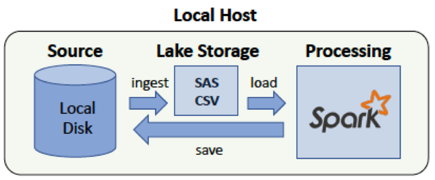

#### Step 3: Define the Data Model
#### 3.1 Conceptual Data Model
- The model consists of 2 dimension tables and 1 fact table. 
    - Dimension table #1 - select columns from immigration dataset: `year`,`month`,`entry_port`, `destination_state`,`citizenship`,`age`, `purpose`, `visa_type`, `purpose`
    - Dimension table #2 - select columns from demographic dataset: `city`,`state_code`,`median_age`,`foreign_born`, `total_population`, `race`, `race_count`
    - Fact table - joined columns from the two datasets: `year`,`month`,`origin_country`, `visa_type`,`visit_purpose`,`state_code`,`city`,`city_population`,`immigrant_count`

**Note:** columns definitions described in the [notebook](./Step4_ETL.ipynb)

#### 3.2 Mapping Out Data Pipelines
- We will use an ELT process with SPARK (_see figure below_)

  

Steps to pipeline the datasets into this model:
1. Extract data (SAS & CSV) from local disk
2. Start a Spark session and import libraries   
3.  Transform datasets using [etl.py](./etl.py) and [utility_functions.py](./utility_functions.py) (details in [Notebook](./Step4_ETL.ipynb))   
4. Create dimension tables; write parquet files partitioned by `state_code`
5. Create fact table; write a parquet file partitioned by `state_code`

**Next:** [ETL Notebook](./Step4_ETL.ipynb)