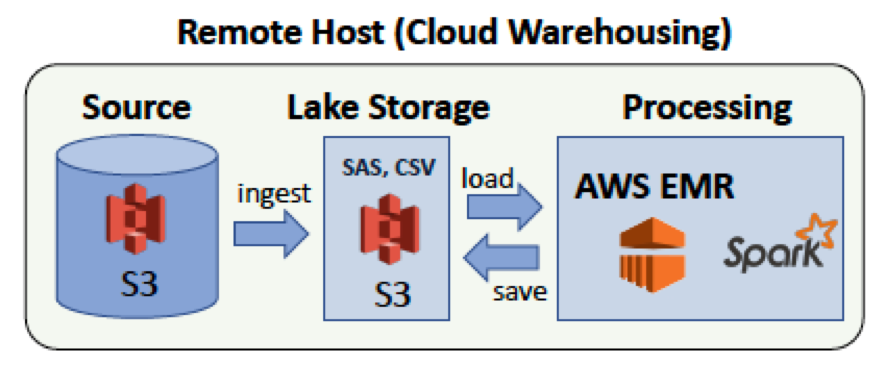

#### Step 5: Project Write Up
* _The rationale for the choice of tools and technologies for the project_.

* _How often the data should be updated and why?_ 

* _How should we would approach the problem differently under the following scenarios_:
    * **The data was increased by 100x**. First of all, I'd store the raw data in the cloud, e.g., in an `S3` bucket. Then, I'd perform the ELT process with SPARK session using an Amazon Redshift cluster (_see figure below_). 

      

    * The data populates a dashboard that **must be updated on a daily basis by 7am every day**.

     * The database **needed to be accessed by 100+ people**.